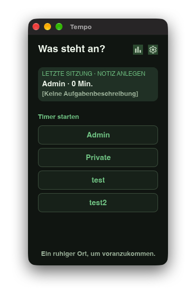
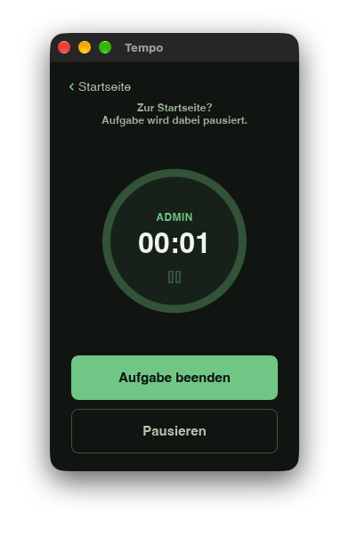
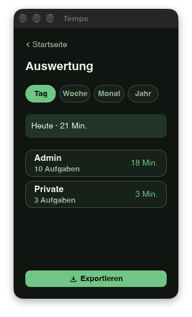

# Tempo

Tempo is a local-first desktop app for focused work sessions. Create a project, start a timer, capture a short activity note, then review and export the recorded time. It is deliberately a personal desktop tool: no account, browser service, team workspace, or cloud synchronisation is required.

## Implemented features

- **Project-based sessions:** create, rename, archive, restore, and permanently delete projects. Archiving removes a project from the start screen but retains its recorded work for evaluation.
- **Focused timer:** start, pause, resume, and end work sessions. Returning to Home pauses the current session; a tray action can interrupt it with another project and restores the first session when the second finishes.
- **Activity notes and time correction:** add or defer a note after a session, later edit or delete completed entries, and correct a session's start and finish times before saving its note.
- **Evaluation:** view totals by project for the current day, week, month, or year; open a project to inspect its completed sessions.
- **Export:** save the current evaluation, or a single project's evaluation, as CSV, Markdown, or JSON.
- **Local data:** projects, sessions, notes, and active-session state are stored in a local SQLite database. A macOS-native menu also exposes SQLite backup and restore.
- **Desktop integration:** the app follows the system light/dark appearance. It uses German for a German system locale and English for every other or unavailable locale. The tray is built on macOS, Windows, and Linux; macOS also provides native menu shortcuts.

Tempo does **not** currently provide automatic activity monitoring, invoicing, billing rates, calendar/task-manager integrations, collaboration, cloud sync, a web application, or a manual in-app language/theme selector.

## Screenshots

| Choose a project | Track a session | Review time |
| --- | --- | --- |
|  |  |  |

The screenshots show the German dark appearance. Tempo follows the operating system’s appearance and chooses German only when the system locale begins with `de`; otherwise it uses English.

## Getting started

### Prerequisites

- A current [Rust toolchain](https://www.rust-lang.org/tools/install) with Cargo.
- A desktop environment supported by [Slint](https://slint.dev/).

### Run locally

```bash
cargo run
```

On a new local database, Tempo opens the first-run flow and asks you to create your first project.

### Test

```bash
cargo test
```

## How to use Tempo

1. Create a project on first start, then choose a project on **What next?**.
2. Start the session, and pause/resume it when needed. Returning to Home pauses it.
3. End the session and save a short activity note, or skip it for now. You can use **Adjust time** before saving the note.
4. Open **Evaluation** to select day, week, month, or year and inspect project totals.
5. Open a project in Evaluation to edit a note or delete an individual completed entry.
6. Choose **Export** to save CSV, Markdown, or JSON for all projects in the chosen period, or for the selected project.

Use **Manage projects** to add, rename, archive, restore, or permanently delete projects. Permanent deletion also removes that project’s recorded work after confirmation.

### macOS data backup

On macOS, the native File menu provides **Back Up Data…** and **Restore Data…**. Backups are SQLite files; restore validates the selected backup and replaces the current Tempo data only after confirmation. Restore finalises any unfinished restored session at its saved checkpoint.

The macOS menu also provides shortcuts for Settings, Evaluation, backup/restore, and starting the first nine projects. The tray menu on supported desktops provides quick open, pause/resume, end-session, and project-switch actions.

## Data and privacy

Tempo stores projects, completed sessions, the active session, and notes in one local SQLite database. The default path is:

| Platform | Default location |
| --- | --- |
| macOS | `~/Library/Application Support/Tempo/tempo.sqlite` |
| Linux | `$XDG_DATA_HOME/Tempo/tempo.sqlite`, or `~/.local/share/Tempo/tempo.sqlite` |
| Windows | `%APPDATA%\\Tempo\\tempo.sqlite` |

The app neither requires a login nor contains a network service for sending task data. This technical behaviour is not by itself a completed privacy-policy or store-privacy declaration; those require the final distributed build and legal/operator details.

## Distribution status

Tempo is a proprietary commercial product under active development. The repository is intended to be private. It contains packaging workflows for macOS, Windows MSIX, and Linux `.deb` builds, but the current macOS configuration is not yet an App Store build: sandboxing, signing, provisioning, and clean-account validation remain open. The Windows MSIX package likewise still needs its final Partner Center identity values and certification validation.

For proposed product positioning, a one-time price, and Apple/Microsoft Store submission fields, see [docs/store-listing.md](docs/store-listing.md).

## Project structure

```text
src/
  controller/       UI command handling and native data actions
  domain/           Projects, sessions, time ranges, and validation
  persistence.rs    SQLite storage, backup/restore, and export writes
  presentation.rs   Domain-to-UI projections and localisation-sensitive labels
  report.rs         CSV, Markdown, and JSON export rendering
ui/
  app-window.slint  Application shell and navigation
  views/            First run, Home, tracking, notes, projects, evaluation, export
  components/       Reusable interface controls
```

The Rust domain model remains independent of the Slint interface; controller and presentation code project stored state into the compact UI models.

## Development notes

- The UI uses [Slint](https://slint.dev/) and follows the system colour scheme.
- German translations are bundled; English is the fallback for non-German locales.
- SQLite is bundled through `rusqlite`, so no separate database server is needed.
- `cargo make slint` starts Slint live preview when `cargo-make` is installed. Live preview deliberately remains English because it does not load the bundled translations.
- The release workflow produces macOS, Windows MSIX, and Linux `.deb` package artifacts. It is not proof of store readiness.
