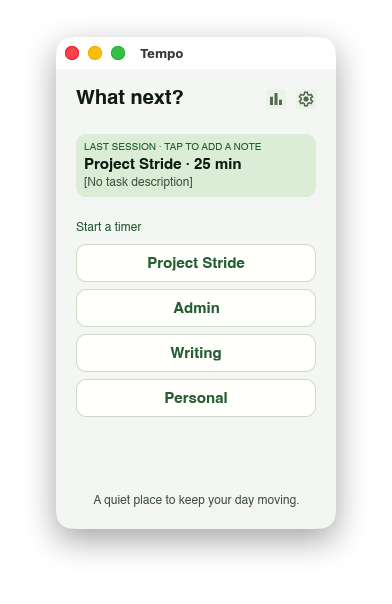
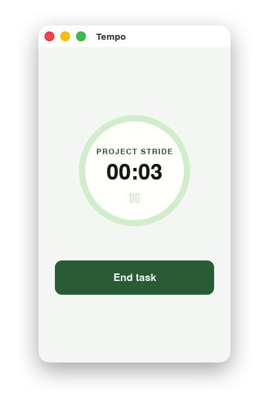
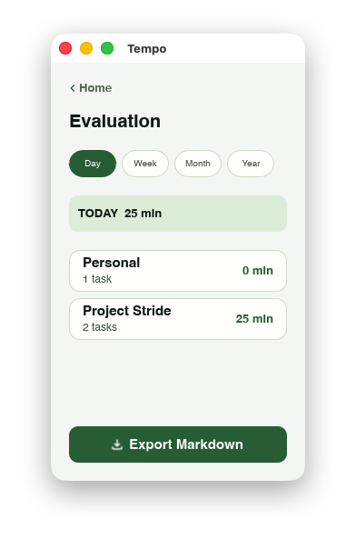

# Tempo

Tempo is a small, local-first desktop app for choosing what to work on, tracking focused sessions, and reviewing where time went. It keeps the workflow deliberately quiet: choose a project, start a timer, add a short note when the session ends, then inspect or export the results.

## What it does

- Organizes work into projects and lets you add, rename, archive, or restore them.
- Starts one focused work session at a time, with pause and resume support.
- Prompts for a note after a completed session so time records retain context.
- Shows totals and recent sessions for a day, week, month, or year.
- Exports the selected evaluation as a Markdown report.
- Stores data locally in a SQLite database—no account or network service is required.

## Screenshots

| Choose a project | Track a session | Review your time |
| --- | --- | --- |
|  |  |  |

## Getting started

### Prerequisites

- A current [Rust toolchain](https://www.rust-lang.org/tools/install) with Cargo.
- A desktop environment supported by Slint.

### Run locally

```bash
cargo run
```

On first launch, Tempo creates a small set of example projects. Select one from the home screen to begin tracking.

### Run the tests

```bash
cargo test
```

## How to use Tempo

1. From **What next?**, select the project you want to work on.
2. Use the timer screen to pause, resume, or end the session.
3. Add a brief note for the completed session, or skip it.
4. Open **Evaluation** to review time by project over a chosen period.
5. Select **Export Markdown** to save that review as a portable report.

Use **Project settings** to manage the project list. Archived projects remain in the saved data and can be restored, but no longer appear as options on the home screen.

## Data and privacy

Tempo stores projects, completed sessions, the current active session, and notes in one local SQLite database. The default file location is:

| Platform | Default location |
| --- | --- |
| macOS | `~/Library/Application Support/Tempo/tempo.sqlite` |
| Linux | `$XDG_DATA_HOME/Tempo/tempo.sqlite`, or `~/.local/share/Tempo/tempo.sqlite` |
| Windows | `%APPDATA%\\Tempo\\tempo.sqlite` |

The app does not require a login or send task data to a remote service.

## Project structure

```text
src/
  domain.rs        Core projects, sessions, time ranges, and report generation
  application.rs   User actions and application-level state
  persistence.rs   SQLite storage and Markdown export
  presentation.rs  Domain-to-UI view models
  ui/              Slint callbacks and UI coordination
ui/
  app-window.slint Application shell and navigation
  views/           Home, timer, note, settings, and evaluation screens
  components/      Reusable interface components
```

The Rust domain model remains independent of the Slint interface. The presentation layer turns persisted data into the compact state consumed by each screen.

## Development notes

- The UI is built with [Slint](https://slint.dev/).
- SQLite is bundled through `rusqlite`, so Tempo's application data does not depend on a separate database server.
- `cargo make slint` starts the app with Slint live preview when `cargo-make` is installed.
- The included Linux container recipe supports release packaging via `cargo make bundle-linux` on macOS with Docker available.

## Status

Tempo is an early desktop application. The current feature set covers local project management, session tracking, notes, evaluation, Markdown export, and durable SQLite storage. Features such as synchronization, collaboration, and advanced task planning are not part of the current app.
